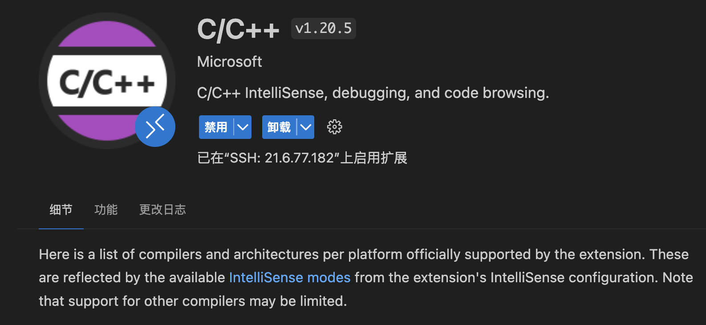
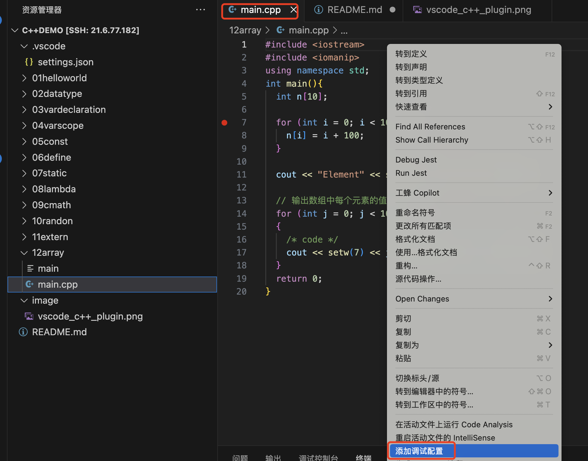
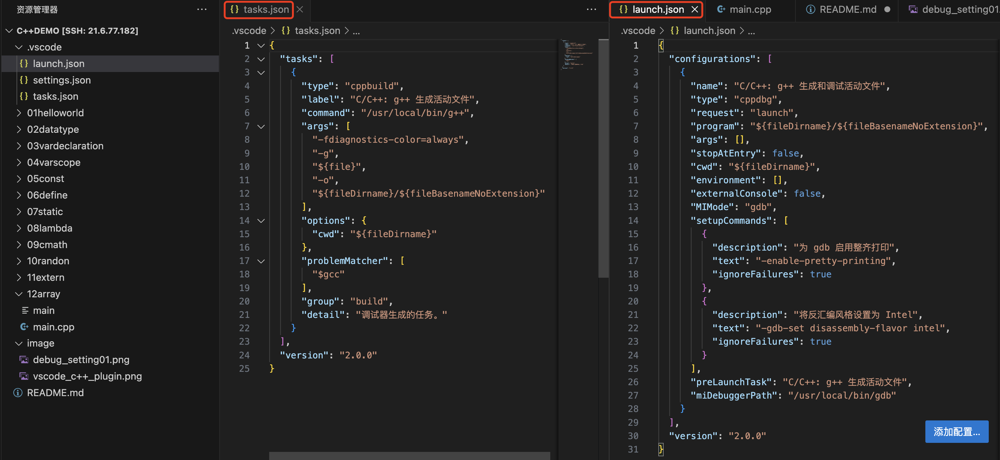
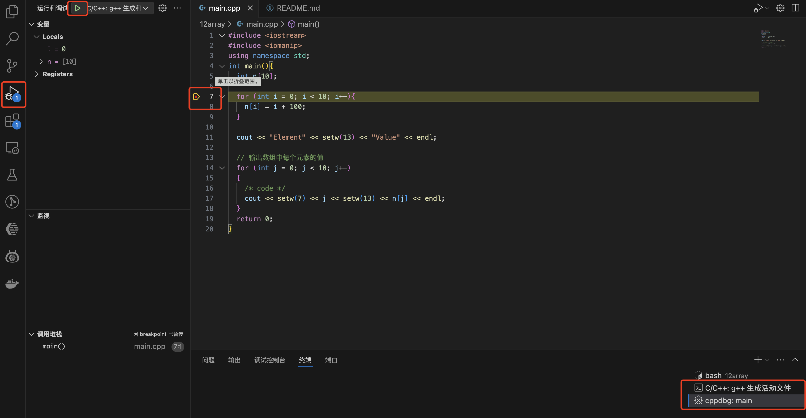
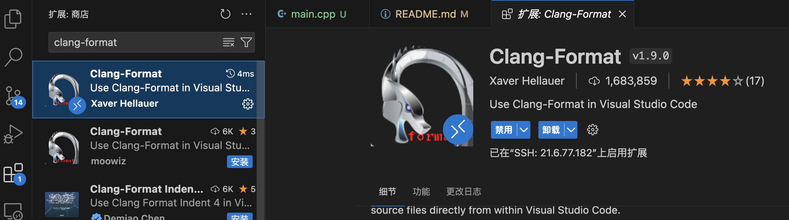

## 1、编译运行

文档链接：https://edu.aliyun.com/course/313633/lesson/341136727
[helloworld 代码](01helloworld/main.cpp)  
编译命令：

```shell
  g++ main.cpp -o main
```

## 2、vscode 运行和 debug 程序

### 安装 c/c++ 插件



### debug 程序

#### step 1:添加调试配置

选择要 debug 的文件，右键后选择“添加调试配置”


#### step 2:查看.vscode 文件夹下的 launch.json 和 tasks.json 文件

  
这两个文件是 Visual Studio Code 的配置文件，用于设置 C++的编译和调试环境。它们通常位于项目的`.vscode`目录下。

`launch.json`文件定义了如何启动调试器。在这个文件中，定义了一个配置，名为"C/C++: g++ 生成和调试活动文件"。这个配置的类型是`cppdbg`，表示使用 C++的调试器。`request`字段为`launch`，表示启动一个新的程序进行调试。`program`字段指定了要调试的程序的路径，这里使用了`${fileDirname}/${fileBasenameNoExtension}`，表示当前编辑的文件（不包括扩展名）所在的目录。`MIMode`字段为`gdb`，表示使用 GNU 调试器。`preLaunchTask`字段为"C/C++: g++ 生成活动文件"，表示在启动调试器之前，先执行这个任务。

`tasks.json`文件定义了一系列的任务，这些任务可以在 VS Code 中执行。在这个文件中，定义了一个任务，名为"C/C++: g++ 生成活动文件"。这个任务的类型是`cppbuild`，表示这是一个 C++的构建任务。`command`字段为`/usr/local/bin/g++`，表示使用 g++编译器。`args`字段定义了编译器的参数，这里包括了`-g`（生成调试信息）和`-o`（指定输出文件的名称）。`cwd`字段指定了工作目录，这里使用了`${fileDirname}`，表示当前编辑的文件所在的目录。

总的来说，这两个文件定义了如何编译和调试 C++代码。当你在 VS Code 中启动调试时，首先会执行`tasks.json`中的"C/C++: g++ 生成活动文件"任务，编译当前的 C++文件。然后，会启动`launch.json`中的"C/C++: g++ 生成和调试活动文件"配置，使用 gdb 调试器启动并调试编译后的程序。

#### step 3:debug 程序



#### step 4:涉及多 cpp 文件的调试

修改 tasks.json 文件，将 `args` 字段设置为 ["-g", "*.cpp", "-o", "\${fileDirname}/output"]  
修改 launch.json 文件，将 `program` 字段设置为 ${fileDirname}/output

### 格式化插件

安装 clang-format 插件  

在 setting.json 文件中，设置文件保存后自动格式化
`"editor.formatOnSave": true`

## 4、static 的使用

`const` 和 `static` 是 C++ 中用于声明变量的关键字，它们有不同的作用和行为。

1. `const`：`const` 是常量修饰符，用于声明一个不可修改的变量。一旦变量被声明为 `const`，其值在声明后就不能再被修改。`const` 变量必须在声明时进行初始化，并且不能在程序的执行过程中修改其值。`const` 变量通常用于表示不可变的常量，例如数学常数或程序中的固定值。

2. `static`：`static` 是静态修饰符，用于声明静态变量。静态变量在程序的生命周期内只被初始化一次，并且在整个程序执行期间都存在。静态变量在声明它的作用域内是持久的，即使超出了其声明的作用域，它的值也会保持不变。静态变量可以在函数内部或全局范围内声明，具体的作用域和可见性取决于其声明的位置。

区别：

- `const` 变量是不可修改的，而 `static` 变量可以被修改。
- `const` 变量必须在声明时进行初始化，而 `static` 变量可以在声明时初始化，也可以在后续的代码中进行初始化。
- `const` 变量的作用域和可见性与普通变量相同，而 `static` 变量的作用域和可见性取决于其声明的位置。
- `const` 变量在每次使用时都会重新计算其值，而 `static` 变量只在第一次使用时进行初始化，后续使用时保持其值不变。

需要注意的是，`const` 和 `static` 可以同时用于变量的声明，例如 `static const int num = 10;`，这样的变量既是静态的，又是不可修改的。

[static 代码](07static/main.cpp)

## 5、lambda 表达式

```shell
[capture](parameters)->return-type{body}
```

例如：

```c++
[](int x, int y) -> int { int z = x + y; return z + x; }
```

[lambda thread 代码](08lambda/main.cpp)  
编译时，需要加入-pthread 选项，确保正确链接 pthread 库

```shell
g++ -pthread main.cpp
```

## 6、指针

[指针代码](14pointer/main.cpp)

```c++
/**
 * 指针 type *var-name;
 */
#include <iostream>
using namespace std;
int main(){
  int var = 20;   // 实际变量的声明
  int *ip;        // 指针变量的声明

  ip = &var;      // 在指针变量中存储 var 的地址
  cout << "Value of var variable: ";
  cout << var << endl;

  // 输出在指针变量中存储的地址
  cout << "Address stored in ip variable: ";
  cout << ip << endl;

  // 访问指针中地址的值
  cout << "Value of *ip variable: ";
  cout << *ip << endl;
  return 0;
}
```

## 7、引用

[引用代码](15reference/main.cpp)

```c++
/**
 * 引用变量是一个别名，也就是说它是已存在变量的另一个名字。创建时必须被初始化
 *
 * 引用和指针的三个主要不同
 * 1、不存在空引用。引用必须连接到一块合法的内存。
 * 2、一旦引用被初始化指向一个对象，就不能被指向到另一个对象。指针可以在任何时候指向到另一个对象。
 * 3、引用必须在创建时被初始化。指针可以在任何时间被初始化。
 */
#include <iostream>
using namespace std;
int main(){
  // 声明简单的变量
  int i;
  double d;

  // 声明引用变量
  int& r = i;
  double& s = d;

  i = 5;
  cout << "Value of i : " << i << endl;
  cout << "Value of i reference : " << r << endl;

  r = 6;
  cout << "Value of i : " << i << endl;
  cout << "Value of i reference : " << r << endl;

  d = 11.7;
  cout << "Value of d : " << d << endl;
  cout << "Value of d reference : " << s << endl;

  return 0;
}
```

## 8、时间

[时间代码](16time/main.cpp)

```c++
#include <iostream>
#include <ctime>
using namespace std;
int main(){
  // 基于当前系统的当前日期/时间
  time_t now = time(0);
  cout << "当前时间："<< now << endl;

  // 把 now 转换为字符串形式
  char* dt = ctime(&now);
  cout << "本地日期和时间：" << dt << endl;

  // 把 now 转换为 tm 结构：
  tm *ltm = localtime(&now);
  cout << "年："<< 1900 + ltm->tm_year << endl;
  cout << "月："<< 1 + ltm->tm_mon << endl;
  cout << "日："<<  ltm->tm_mday << endl;
  cout << "时间："<< ltm->tm_hour << ":";
  cout << ltm->tm_min << ":";
  cout << ltm->tm_sec << endl;
}
```

## 9、结构体

[结构体代码](17struct/main.cpp)

```c++
#include <iostream>
#include <string>
using namespace std;
struct Book{
  string title;
  string author;
  string subject;
  int book_id;
  void printBook(){
    cout << "Book title : " << title <<endl;
    cout << "Book author : " << author <<endl;
    cout << "Book subject : " << subject <<endl;
    cout << "Book book_id : " << book_id <<endl;
  }
};

int main(){
  Book book;
  book.title = "C++ 教程";
  book.author = "Runoob";
  book.subject = "编程语言";
  book.book_id = 12345;
  book.printBook();
  return 0;
}
```

## 10、class 类

[类代码](18class/main.cpp)

```c++
#include <iostream>
using namespace std;
class Box {
public:
  double length;  // 长度
  double breadth; // 宽度
  double height;  // 高度
  double getVolume(void) { return length * breadth * height; }
};
int main() {
  Box box1; // 声明 box1，类型为 Box
  box1.length = 5.0;
  box1.breadth = 4.0;
  box1.height = 6.0;

  cout << "box1 的体积：" << box1.getVolume() << endl;
  return 0;
}
```

## 11、继承

[继承代码](19extend/main.cpp)

- 语法：class derived-class: access-specifier base-class1, access-specifier

访问控制和继承

| 访问     | public | protected | private |
| -------- | ------ | --------- | ------- |
| 同一个类 | yes    | yes       | yes     |
| 派生类   | yes    | yes       | no      |
| 外部的类 | yes    | no        | no      |

```c++
#include <iostream>
using namespace std;
// 基类Shape
class Shape {
public:
  void setWidth(int w) { width = w; }
  void setHeight(int h) { height = h; }

protected:
  int width;
  int height;
};
// 基类PaintCost
class PaintCost {
public:
  int getCost(int area) { return area * 70; }
};
// 派生类Rectangle
class Rectangle : public Shape, public PaintCost {
public:
  int getArea() { return width * height; }
};
int main(void) {
  Rectangle rect;
  int area;

  rect.setHeight(7);
  rect.setWidth(5);

  area = rect.getArea();

  cout << "Total area: " << rect.getArea() << endl;
  cout << "Total paint cost: $" << rect.getCost(area) << endl;
}
```

## 12、重载

在同一个作用域内，可以声明几个功能类似的同名函数，但是这些同名函数的形式参数（指参数的个数、类型或者顺序）必须不同。您不能仅通过返回类型的不同来重载函数。

[重载代码](20overload/main.cpp)

```c++
#include <iostream>
using namespace std;
class PrintData {
public:
  void print(int i) { cout << "整数为：" << i << endl; }
  void print(double f) { cout << "浮点数为：" << f << endl; }
  void print(char *c) { cout << "字符串为：" << c << endl; }
};
int main() {
  PrintData pd;
  pd.print(5);
  pd.print(500.263);
  pd.print("hello world");
  return 0;
}
```

## 13、运算符重载

重载的运算符是带有特殊名称的函数，函数名是由关键字 operator 和其后要重载的运算符符号构成的。与其他函数一样，重载运算符有一个`返回类型`和一个`参数列表`。

[重载代码](21overloadoperator/main.cpp)

例如：Box operator+(const Box&);

```c++
#include <iostream>
using namespace std;
class Box {
public:
  double getVolume() { return length * breadth * height; }
  void setLength(double len) { length = len; }
  void setBreadth(double bre) { breadth = bre; }
  void setHeight(double hei) { height = hei; }
  Box operator+(const Box &b) { // 参数是引用，为了增加效率同时防止修改
    Box box;
    box.length = this->length + b.length;
    box.breadth = this->breadth + b.breadth;
    box.height = this->height + b.height;
    return box;
  }

private:
  double length;  // 长度
  double breadth; // 宽度
  double height;  // 高度
};

int main(void) {
  Box box1; // 声明 box1，类型为 Box
  Box box2; // 声明 box2，类型为 Box
  Box box3; // 声明 box3，类型为 Box

  double volumn = 0.0; // 定义体积变量

  // box1 详述
  box1.setHeight(5.0);
  box1.setBreadth(7.0);
  box1.setLength(6.0);

  // box2 详述
  box2.setHeight(12.0);
  box2.setBreadth(13.0);
  box2.setLength(10.0);

  volumn = box1.getVolume(); // 返回 box1 的体积
  cout << "box1 的体积：" << volumn << endl;
  volumn = box2.getVolume(); // 返回 box2 的体积
  cout << "box2 的体积：" << volumn << endl;

  box3 = box1 + box2;        // 将两个 box 相加
  volumn = box3.getVolume(); // 返回 box3 的体积
  cout << "box3 的体积：" << volumn << endl;

  return 0;
}
```


## 14、多态
[多态代码](22polymorphism/main.cpp)
```c++
/**
 * C++ 多态意味着调用成员函数时，会根据调用函数的对象的类型来执行不同的函数。
 * 虚函数 是在基类中使用关键字 virtual
 * 声明的函数。在派生类中重新定义基类中定义的虚函数时，会告诉编译器不要静态链接到该函数。
 * 我们想要的是在程序中任意点可以根据所调用的对象类型来选择调用的函数，这种操作被称为动态链接，或后期绑定。
 */
#include <iostream>
using namespace std;
class Shape {
protected:
  int width, height;

public:
  Shape(int a, int b) {
    width = a;
    height = b;
  };
  virtual int area() {
    cout << "parent class area :" << endl;
    return 0;
  }
};
class Rectangle : public Shape {
public:
  Rectangle(int a = 0, int b = 0) : Shape(a, b){};
  int area() {
    cout << "Rectangle class area :" << endl;
    return width * height;
  }
};
class Triangle : public Shape {
public:
  Triangle(int a = 0, int b = 0) : Shape(a, b){};
  int area() {
    cout << "Triangle class area :" << endl;
    return width * height / 2;
  }
};
int main() {
  Shape *shape;
  Rectangle rectangle(10, 7);
  Triangle triangle(10, 5);
  shape = &rectangle;
  shape->area();
  shape = &triangle;
  shape->area();
  return 0;
}
```

您可能想要在基类中定义虚函数，以便在派生类中重新定义该函数更好地适用于对象，但是您在基类中又不能对虚函数给出有意义的实现，这个时候就会用到纯虚函数。

```c++
class Shape {
   protected:
      int width, height;
   public:
      Shape( int a=0, int b=0)
      {
         width = a;
         height = b;
      }
      // pure virtual function
      virtual int area() = 0;
};
```

## 15、抽象类、接口
[抽象类代码](23abstractclass/main.cpp)
```c++
/**
 * 如果类中至少有一个函数被声明为纯虚函数，则这个类就是抽象类。纯虚函数是通过在声明中使用
 * "= 0" 来指定的。
 * 接口可以被视为一个特殊的抽象类，没有成员变量和实现的函数（全部都是纯虚函数）。而抽象类可以有成员变量和和提供默认实现的普通虚函数
 */
#include <iostream>
using namespace std;
// 抽象类
class Shape {
public:
  // 纯虚函数
  virtual int getArea() = 0;
  void setWidth(int w) { width = w; }
  void setHeight(int h) { height = h; }

protected:
  int width, height;
};
// 派生类
class Rectangle : public Shape {
public:
  int getArea() { return (width * height); }
};
class Triangle : public Shape {
public:
  int getArea() { return (width * height / 2); }
};
int main() {
  Rectangle rect;
  Triangle tri;

  rect.setWidth(5);
  rect.setHeight(7);
  // 输出对象的面积
  cout << "Total Rectangle area: " << rect.getArea() << endl;

  tri.setWidth(5);
  tri.setHeight(7);
  // 输出对象的面积
  cout << "Total Triangle area: " << tri.getArea() << endl;

  return 0;
}
```

## 16、文件流
[文件流代码](24fileandstream/main.cpp)

```c++
/**
 * 要在 C++ 中进行文件处理，必须在 C++ 源代码文件中包含头文件 <iostream> 和
 * <fstream>。 在从文件读取信息或者向文件写入信息之前，必须先打开文件。ofstream
 * 和 fstream
 * 对象都可以用来打开文件进行写操作，如果只需要打开文件进行读操作，则使用
 * ifstream 对象。下面是 open() 函数的标准语法，open() 函数是 fstream、ifstream
 * 和 ofstream 对象的一个成员
 *
 */
#include <fstream>
#include <iostream>
using namespace std;
int main() {
  char data[100];

  // 以写模式打开文件
  ofstream outfile;
  outfile.open("afile.txt");

  cout << "Writing to the file" << endl;
  cout << "Enter your name: ";
  cin.getline(data, 100);

  // 向文件写入用户输入的数据
  outfile << data << endl;
  cout << "Enter your age: ";
  cin >> data;
  cin.ignore();

  // 再次向文件写入用户输入的数据
  outfile << data << endl;

  // 关闭打开的文件
  outfile.close();

  // 以读模式打开文件
  ifstream infile;
  infile.open("afile.txt");

  cout << "Reading from the file" << endl;
  infile >> data;

  // 在屏幕上写入数据
  cout << data << endl;

  // 再次从文件读取数据，并显示它
  infile >> data;
  cout << data << endl;

  // 关闭打开的文件
  infile.close();

  return 0;
}
```

## 17、异常
[异常代码](25exception/main.cpp)
```c++
/**
 * 如果有一个块抛出一个异常，捕获异常的方法会使用 try 和 catch 关键字。try
 块中放置可能抛出异常的代码，try 块中的代码被称为保护代码。使用 try/catch
 语句的语法如下所示：
 * try{
   // 保护代码
   }catch( ExceptionName e1 ){
   // catch 块
   }catch( ExceptionName e2 ){
   // catch 块
   }catch( ExceptionName eN ){
   // catch 块}
 */
#include <exception>
#include <iostream>
#include <string>
using namespace std;
struct MyException : public exception {
  string message; // 用于存储错误信息的字符串
  // 构造函数，将错误信息保存到成员变量中
  MyException(const string &message) : message(message) {}
  const char *what() const throw() { return message.c_str(); }
};
int main() {
  try {
    /* code */
    throw MyException("Custom C++ Exception with parameters");
  } catch (const MyException &e) {
    cout << "MyException caught" << '\n';
    cout << e.what() << '\n';
  } catch (const std::exception &e) {
    std::cerr << e.what() << '\n';
  }
}
```

## 18、动态分配
[动态分配](26dynamicmemory/main.cpp)
```c++
/**
 * C++ 程序中的内存分为两个部分：
 * 栈：在函数内部声明的所有变量都将占用栈内存。
 * 堆：这是程序中未使用的内存，在程序运行时可用于动态分配内存。
 *
 * 在 C++ 中，创建对象的方式主要有两种：动态分配和静态（或自动）分配
 *
 * 1、动态分配（使用 new 关键字）
 *  Box* myBox = new Box();
 *  内存分配：这行代码使用new操作符在堆（heap）上动态分配内存。堆是一个用于动态内存分配的内存区域，程序运行时可以从中分配和释放内存。
 *  生命周期：由new创建的对象的生命周期直到使用delete显式释放它们的内存之前都一直存在。这意味着，除非你主动释放内存，否则对象会一直存在，即使它的作用域已经结束。
 *  访问方式：通过指针访问对象。你需要使用指针操作符 -> 来访问对象的成员。
 *  内存管理责任：使用new创建对象后，你需要负责在适当的时候使用delete来释放内存，否则会导致内存泄漏。
 *
 * 2、静态（自动）分配
 *  Box myBox;
 *  内存分配：这行代码在栈（stack）上分配内存。栈是一个用于存储局部变量的内存区域，它具有自动的内存管理特性，即变量在其作用域结束时自动销毁。
 *  生命周期：栈上的对象的生命周期与其作用域绑定。当对象的作用域结束时（例如，函数返回时），对象会自动被销毁，其析构函数会被调用。
 *  访问方式：直接通过对象名访问。使用点操作符 . 来访问对象的成员。
 *  内存管理责任：不需要程序员手动管理内存。对象的创建和销毁完全自动化，无需担心内存泄漏。
 */
#include <iostream>
using namespace std;
class Box {
public:
  Box() { cout << "Constructor called." << endl; }
  ~Box() { cout << "Destructor called." << endl; }
};
int main() {
  Box *myBox = new Box();
  delete myBox;
  return 0;
}
```

## 19、命名空间
[命名空间代码](27namespace/main.cpp)
```c++
/**
 * 命名空间：可作为附加信息来区分不同库中相同名称的函数、类、变量等。
 * 本质上，命名空间就是定义了一个范围。
 * namespace namespace_name {// 代码声明}
 *
 * 命名空间可以定义在几个不同的部分中，因此命名空间是由几个单独定义的部分组成的。一个命名空间的各个组成部分可以分散在多个文件中
 * 命名空间可以嵌套，您可以在一个命名空间中定义另一个命名空间，如下所示：
 * namespace namespace_name1 {
 * // 代码声明
 *  namespace namespace_name2 {
 *   // 代码声明
 * }}
 */
#include <iostream>
using namespace std;
// 第一个命名空间
namespace first_space {
void func() { cout << "Inside first_space" << endl; }
} // namespace first_space
// 第二个命名空间
namespace second_space {
void func() { cout << "Inside second_space" << endl; }
} // namespace second_space

using namespace first_space;
int main() {
  func();
  return 0;
}
```

## 20、模板
[模板代码](28template/main.cpp)
```c++
/**
 * 模板是泛型编程的基础，泛型编程即以一种独立于任何特定类型的方式编写代码。
 * 函数模板：
 * template <class type> ret-type func-name(parameter list){
 * // 函数的主体
 * }
 *
 * 类模板：
 * template <class type> class class-name {...}
 */
#include <iostream>
#include <stdexcept>
#include <string>
#include <vector>
using namespace std;
template <class T> class Stack {
private:
  vector<T> elems; // 元素
public:
  void push(T const &); // 入栈
  void pop();           // 出栈
  T top() const;        // 返回栈顶元素
  bool empty() const {  // 如果为空则返回真。
    return elems.empty();
  }
};
template <class T> void Stack<T>::push(T const &elem) {
  // 追加传入元素的副本
  elems.push_back(elem);
}
template <class T> void Stack<T>::pop() {
  if (elems.empty()) {
    throw out_of_range("Stack<>::pop(): empty stack");
  }
  // 删除最后一个元素
  elems.pop_back();
}
template <class T> T Stack<T>::top() const {
  if (elems.empty()) {
    throw out_of_range("Stack<>::top(): empty stack");
  }
  // 返回最后一个元素的副本
  return elems.back();
}
int main() {
  try {
    /* code */
    Stack<int> intStack;       // int 类型的栈
    Stack<string> stringStack; // string 类型的栈

    // 操作 int 类型的栈
    intStack.push(7);
    cout << intStack.top() << endl;

    // 操作 string 类型的栈
    stringStack.push("hello");
    cout << stringStack.top() << std::endl;
    stringStack.pop();
    stringStack.pop();
  } catch (const std::exception &e) {
    std::cerr << e.what() << '\n';
    return -1;
  }
  return 0;
}
```

## 21、#define 宏
[define](29define/main.cpp)
```c++
/**
 * #define 预处理指令用于创建符号常量，改符号常量通常称为宏，指令的一般形式为：
 * #define macro-name replacement-text
 *
 * 当这一行代码出现在一个文件中时，在该文件中后续出现的所有宏都将会在程序编译之前被替换为replacement-text。
 */
#include <iostream>
using namespace std;
#define PI 3.14159
int main() {
  cout << "Value of PI :" << PI << endl;
  return 0;
}
```
使用 -E 进行编译，并把结果重定向到 main.p 文件，将会看到他已经包含大量的信息，而且在文件底部的值被改为如下
```shell
g++ -E main.cpp > main.p
```
```c++
...
using namespace std;

int main() {
  cout << "Value of PI :" << 3.14159 << endl;
  return 0;
}

```

## 22、#ifdef 条件编译
```c++
/**
 * 通过#define #ifndef #ifdef #endif 可以实现条件
 * 有选择地对部分程序源代码进行编译
 *
 * 在命令行中操作宏定义，现在源代码中注释掉 #define DEBUG
 * 使用 -DDEBUG 选项来定义 DEBUG 宏
 */
#include <iostream>
using namespace std;
#define DEBUG
#define MIN(a, b) ((a) < (b) ? (a) : (b))
int main() {
  int i, j;
  i = 100;
  j = 30;
#ifdef DEBUG
  cerr << "Trace: Inside main function" << endl;
#endif

#if 0
    /* 这是注释部分 */
   cout << MKSTR(HELLO C++) << endl;
#endif
  cout << "The minimum is " << MIN(i, j) << endl;
#ifdef DEBUG
  cerr << "Trace: Coming out of main function" << endl;
#endif
}
```